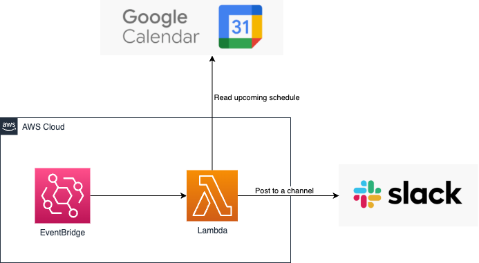

# ⏰google-calendar-remind-scheduler-example
A sample application that uses AWS stack to periodically remind the schedule in Google Calendar

## System Overview


## Prerequisites
- [direnv](https://github.com/direnv/direnv)
- [sops](https://github.com/mozilla/sops)
- [lambroll](https://github.com/fujiwara/lambroll#install)

## Set up

Configure your following environment variables to `.env`

```
cat << EOF > .env
LOG_LEVEL=INFO

# Your Google Calendar ID
GOOGLE_CALENDAR_ID='xxx@group.calendar.google.com'

# Your Slack channel ID for posting
SLACK_CHANNEL_ID='xxx'

# SSM Parameter Store Key names
PARAM_KEY_SERVICE_ACCOUNT_JSON='/google-calendar-remind-scheduler/GCP_SERVICE_ACCOUNT_CREDENTIAL_JSON'
PARAM_KEY_SLACK_API_TOKEN='/google-calendar-remind-scheduler/SLACK_API_TOKEN'

# S3 bucket for .tfstate(s3 backend .tfstate is managed by ./terraform directory)
TFSTATE_URL=s3://google-calendar-remind-scheduler.example.com/terraform.tfstate
EOF
```

The KMS key is needed for encryption using sops.
Create the key first according to the README in the /terraform directory.

Configure SOPS_KMS_ARN value in `.envrc`(Ensure direnv is installed in your environment)

```
export SOPS_KMS_ARN='arn:aws:kms:<region>:account_id:key/xxx'
```

And then encrypt `.env` to `.enc.env` by using sops.

```
sops -e .env > .enc.env
```

## help

```
make help
```

```
 Choose a command

  bootstrap  🌱 Bootstrap project
  run        💻 Run main script locally
  archive    📦 Archive AWS Lambda function as a zip
  deploy     🚀 Deploy a function to AWS Lambda
  invoke     💨 Invoke deployed lambda function
```

## AWS Infra resources
see [./terraform/README.md](https://github.com/hrfmmr/google-calendar-remind-scheduler-example/blob/main/terraform/README.md)
